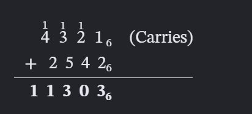
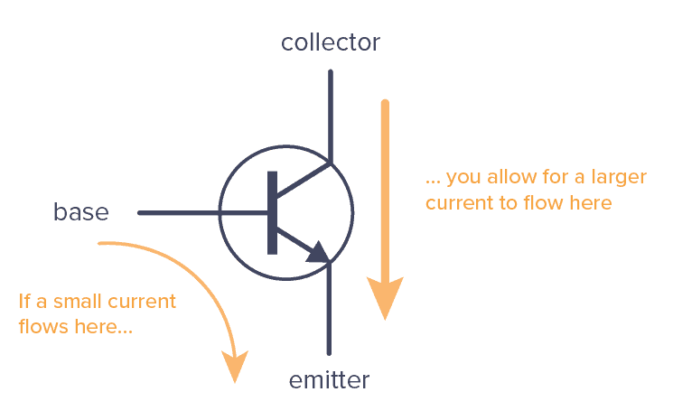
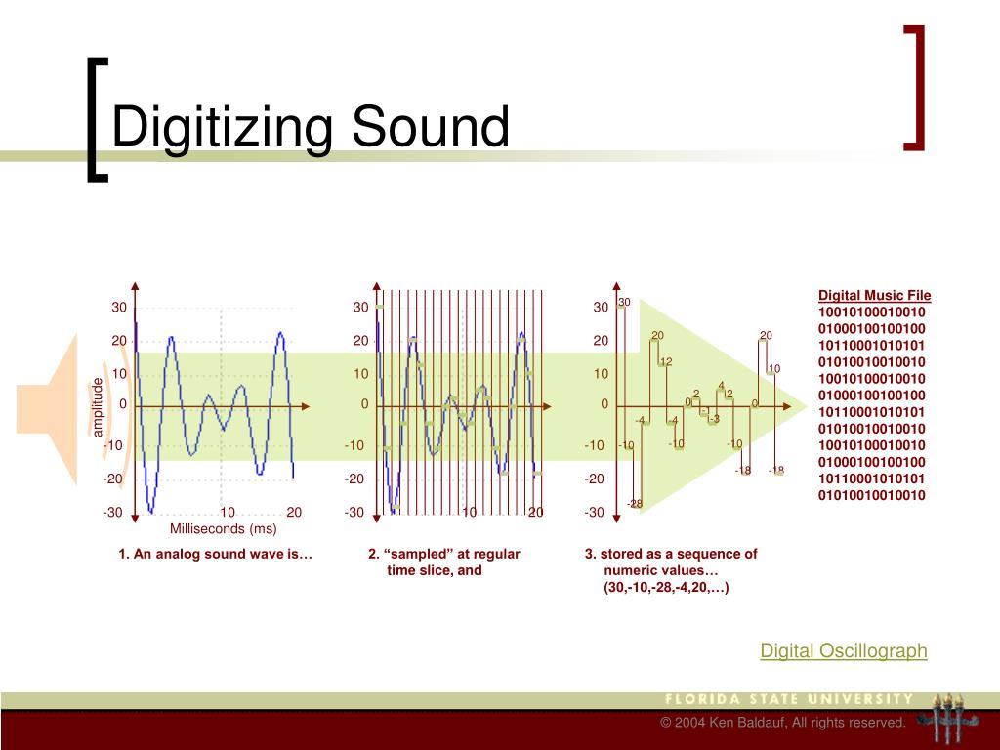

# IntroCS-Track-A

# Class 1 - 31/08/2026 

What is a computer?

v.g: Cellphones, E-Cars, Tablet, Bio-Computer

A computer has an Input, a central unit to process the input, and it generates an Output

- Hardware
- Software

More specifically it follows the von Neumann architecture

Input Device -> Central Processing Unit {Control UJnit, Arithmetic/Logic Unit} <-> Memory Unit -> Output

# Class 2 - 07/09/2026 

## Converting

How to transform a decimal number into any other base?

Here is the step-by-step process:

Divide the decimal number by the new base B.

1 - Write down the remainder. (This remainder will be a digit in the new base).

2 - Replace the decimal number with the quotient (the result of the division).

3 - Repeat steps 1–3 until the quotient becomes 0.

4 - Read the remainders backwards (from the last remainder to the first). This is your final answer.

Important: Digits in Bases larger than 10
If your new base is larger than 10 (like base-16 hexadecimal), you need letters to represent digits above 9:

10 = A

11 = B

12 = C

13 = D

14 = E

15 = F
(And so on for higher bases)

example:

35 in the base of 3

35 ÷ 3 = 11 R 2

11 ÷ 3 = 3 R 2

3 ÷ 3 = 1 R 0

1 ÷ 3 = 0 R 1

Read backwards: 1022

## Arithmetric Operations

### Addition and Subtraction

In base B:

You are allowed digits from 0 to B-1.

You carry when a column's sum reaches B (not 10, not 2, but B).

You borrow an amount of B from the left column (not 10, not 2, but B).

When you "borrow", you add B amount.

For multiplication in a generic base B, the logic stays exactly the same as decimal and binary, but now you have to deal with larger times tables.

Here is the golden rule for multiplying in base B:

### Multiplication and Division

When you multiply two digits and get a product P, you write down P mod B (the remainder) and carry P ÷ B (the quotient) to the next column.

Just like in base 10, if you multiply 7 x 8 = 56, you write down 6 (56 mod 10) and carry 5 (56 ÷ 10). In base B, you do the exact same thing, just with a different number.

## Bit, byte, words 

Bit (The Smallest Unit), 

Byte (The Standard Building Block), 8 bits stuck together (e.g., 10110011) ( A single letter in a book)

Word (The Natural Size), A group of multiple Bytes (usually 2, 4, or 8 bytes), (default chunk of data that a computer's processor (CPU) prefers to handle at one time.) 

 - A 32-bit computer has a Word = 4 bytes (32 bits).

 - A 64-bit computer has a Word = 8 bytes (64 bits).

 ## How 1s and 0s are made in computers

  TRANSISTORS

   A transistor is essentially just a tiny electronic switch

Source: Electricity enters here.

Drain: Electricity exits here.

Gate: The "key" that controls the flow.

When you apply a small voltage (electrical pressure) to the Gate, it acts like you squeezing the hose—it opens a bridge inside the transistor, allowing electricity to flow freely from the Source to the Drain.

When you remove the voltage from the Gate, the bridge closes, and electricity stops flowing.
# Class 3 — 14/09/2026

## Analog Signals

Analog signals represent information continuously, so they can theoretically contain infinite information. Computers cannot store continuous signals exactly, so they store an approximation.

$$
\text{Analog} \rightarrow \text{Digital}
$$

1. **Encode:** convert analog information into digital form.
2. **Compress:** reduce the bit rate while preserving useful information.

---

## Representing Negative Integers

For signed integers, we use **two's complement**.

To obtain \(-x\):

1. Write \(x\) in binary.
2. Invert all bits.
3. Add \(1\).

Example:

$$
4=00000100
$$

$$
\sim4=11111011
$$

$$
11111011+1=11111100=-4
$$

Two's complement avoids having separate \(+0\) and \(-0\), and allows ordinary binary addition to work for signed numbers.

With \(8\) bits:

$$
2^8=256\text{ possible values}
$$

so the range is

$$
\boxed{-128\leq x\leq127}
$$

In general, with \(n\) bits:

$$
\boxed{-2^{n-1}\leq x\leq2^{n-1}-1}
$$

---

## Digitalizing Real Numbers

Real numbers cannot all be represented exactly using a finite number of bits. We therefore use **floating-point representation**, based on binary scientific notation:

$$
1.xxxxx_2\times2^e
$$

For example:

$$
3.14\approx1.1001000\ldots_2\times2^1
$$

### IEEE 754 — 32-bit Float

A 32-bit floating-point number consists of:

$$
\boxed{1\text{ sign bit}+8\text{ exponent bits}+23\text{ fraction bits}}
$$

$$
\underbrace{S}_{1}
\quad
\underbrace{EEEEEEEE}_{8}
\quad
\underbrace{FFFFFFFFFFFFFFFFFFFFFFF}_{23}
$$

### Sign

$$
S=0\rightarrow+
$$

$$
S=1\rightarrow-
$$

### Exponent

The exponent uses a **bias of 127**:

$$
E=e+127
$$

### For example

For a **32-bit IEEE 754 float**, we don't simply keep 32 binary digits of \(33.2132\). We first convert it to binary, then **normalize** it and keep **23 fraction bits**.

Starting with:

$$
33.2132_{10}
$$

We already have:

$$
33_{10}=100001_2
$$

For the fractional part:

$$
0.2132_{10}=0.001101101001010001000110011100\ldots_2
$$

Therefore:

$$
33.2132_{10}
=
100001.001101101001010001000110011100\ldots_2
$$

Normalize:

$$
\boxed{
1.000010011011010010100010001100111\ldots_2
\times2^5
}
$$

Now IEEE 754 single precision uses:

* **Sign:** \(0\)
* **Exponent:** \(5+127=132=10000100_2\)
* **Fraction:** first 23 bits after the leading \(1\)

$$
\text{Fraction}=00001001101101001010001
$$

Thus the **32-bit representation** is:

$$
\boxed{
0\;10000100\;00001001101101001010001
}
$$

or without spaces:

$$
\boxed{01000010000001001101101001010001}
$$

So \(33.2132\) is stored approximately as that 32-bit pattern.

### Fraction

For normalized numbers, the leading \(1\) is implicit:

$$
1.xxxxx_2
$$

so only the bits after the binary point are stored.

---

## Precision and Range

The two main limitations of floating-point representation are:

$$
\boxed{\text{Fraction}\rightarrow\text{precision}}
$$

$$
\boxed{\text{Exponent}\rightarrow\text{range}}
$$

Some decimal numbers, such as \(0.1\), cannot be represented exactly in binary, so floating-point calculations involve approximations and rounding.

---

## Overflow and Underflow

**Overflow:** the value is too large to be represented.

**Underflow:** the value is too close to zero to be represented normally.

IEEE 754 also defines special values such as:

$$
+\infty,\quad-\infty,\quad\mathrm{NaN}
$$

---

## Ariane 5

The Ariane 5 Flight 501 failure is a famous example of a numerical overflow problem.

A value was converted from a 64-bit floating-point number to a 16-bit signed integer, but the value was too large for the integer representation. This caused an overflow and ultimately contributed to the failure of the rocket's guidance system.

$$
\boxed{\text{Bad numerical representation}
\rightarrow
\text{Overflow}
\rightarrow
\text{System failure}}
$$

---

## Main Idea

Computers represent real-world information using a **finite number of bits**.

Therefore, every representation has limitations involving:

$$
\boxed{\text{Precision, Range, and Storage}}
$$

## Digitilizing Audio

# Data Compression — Short Explanation

**Data compression** = reducing the number of bits needed to store or send data.

---

## String Example (Lossless)

**Original:** `AAAAABBBBBCCCCCDDDDD` (20 chars = 160 bits)

**Compressed (Run-Length Encoding):** `5A5B5C5D` (8 bytes = 64 bits)

**Lossless** — exact reconstruction. Ratio ≈ **2.5:1**

---

## Video Example (Lossy)

**Raw 1080p @ 30fps:** ~1.5 Gbps (~186 MB/sec) — impossible to stream.

**Compressed (H.264):** ~20 Mbps → **~75:1 ratio**

**How?** Three tricks:
1. **Spatial** — compress each frame like a JPEG
2. **Temporal** — store only *changes* between frames (I, P, B frames)
3. **Perceptual** — throw away details the eye can't see

**Lossy** — approximate, but visually fine.

---

## Key Difference

| | Lossless | Lossy |
|---|---|---|
| Reversible? | Yes | No |
| Ratio | 2:1 – 10:1 | 10:1 – 200:1 |
| Used for | Text, ZIP, PNG, FLAC | JPEG, MP3, MP4 |

---

## One-Liner

> **String:** `AAAAABBBBB` → `5A5B` (exact, small win).
> **Video:** Store one full frame, then only the **changes** → huge win, tiny quality loss.